## &nbsp;Background


&nbsp;&nbsp; As the end of our business intelligence course is around the corner, we are faced with the final project. It's nice and fortunate that we can choose our own topics that we are interested in. I feel more than grateful that our professor is open-minded and provides us with such a golden opportunity to ignite our creativity. There is no denying that not only will such a stratagy strengthen our ability but it will also boost our interest in this field. What's more, through this term of study, I feel honored to talk with BaiDu's software engineers in the wechat group and offer my own solution for a bug I found for AiStudio when dealing with Cat-Face Detection problems. 

&nbsp;&nbsp; As the P.E class monitor in our class and the member of the soccor team of our department, I am a soccor fan and I feel enthusiastic about data analysis in the sports fields.
 
 
 
&nbsp;&nbsp; *EPL* (English Premier League) is universally viewed as the best soccor league around the world. Several long-lasting soccor teams like Man United, Arsenal and Chelsea enjoy tremendous success both in the sports field and in the finanicial field. As a soccor fan, I do some analysis on the  results of all the games in the past 25 years and also make a small prediction.

&nbsp;&nbsp; Moreover, I prepare 'One More Thing' in this project so that the project can be more appealing.


## &nbsp; Requirement Analysis

&nbsp;&nbsp; Data analysis is undoubtedly a heated topic nowadays. To fulfill our project, I firstly need to get the data. When it comes to such a topic, I can either create a web crawler or find the data from some **existing databases**.

&nbsp;&nbsp; Then I will look through the data and find out how the teams perform in the past decades, how teams' performance differs when they are hometeams or awayteams, which team has the dominating performance, how some famous teams perform when they are faced with their derby competitors and so on. 

&nbsp;&nbsp; Undoubtedly, I have various ways to analyse the data and find something interesting. Then I can do some work on <b>data visualization</b> so that my results can be more vivid and user-friendly.

&nbsp;&nbsp; Also, with all the performance in the past decades, I can't stop **predicting the performance of some teams**.


## &nbsp; Requirement Fulfillment

### Dataset

+ &nbsp;&nbsp; There is no doubt that data acquisition comes first. In my last year of interdisciplinary project with students in *Economy and Management School*, I had a great harvest. During this period, when some data was needed, what came to my mind was usually the web crawler, whereas my partner would often turn to some famous databases like *Wind*.  **I must admit that turning to existing databases for help if possible is a nice and efficient way to fulfill the data acquisition.**


 

+ &nbsp;&nbsp; As for this project, I find a famous website *ESPN* helpful. It is widely regarded as "The Worldwide Leader in Sports", and I can download the dataset I need for free. Apart from that, I can also get access to other datasets concerning *FIFA World Cup*, *NBA* and so on.

### Environment

+ MacOS + Anaconda + Python 3.6 + Pycharm

+ pandas, numpy
+ seaborn, matplotlib.pyplot
+ sklearn.preprocessingc
+ sklearn.luster
+ jieba, zhon, wordcloud


 ```
import pandas as pd
import numpy as np
import seaborn as sns
import matplotlib.pyplot as plt

 ```
 
### Data Analysis
---

#### Data loading

+ &nbsp;Firstly, use ` read_csv ` to load the dataset.

+ ` epl_data = pd.read_csv('input/EPL_Set.csv')`
+ &nbsp;Then check whether the loading process is successful.
+ `print(epl_data.tail())`

 

---

#### Process and add some columns 

- In the dataset, we can't directly get access to the winning team of each game and the points (win for 3, draw for 1, lose for 0). It can be of great help if I have them, so I will do some operation on the dataset to add some columns.

```
conditions=[epl_data['FTR']=='A',epl_data['FTR']=='H',epl_data['FTR']=='D']
choices = [epl_data['AwayTeam'],epl_data['HomeTeam'],'Draw']

epl_data['Winner']=np.select(conditions,choices)

home_scores=[0,3,1]
epl_data['HomeScore']=np.select(conditions,home_scores)

away_scores=[3,0,1]
epl_data['AwayScore']=np.select(conditions,away_scores)

print(epl_data.tail())
```
 

---

#### Which team has the dominating performance in the past dacades?

+ Once I have the data, the first thing I want to do is to determine which team wins the most in the past decades. Then I calculate the number of each team's winning times each season and determine which team wins most each season.

```
tmp=epl_data.loc[:,['Season','Winner']]
win = tmp.groupby(['Season', 'Winner']).size().reset_index(name='counts')
sort = win.sort_values(['Season', 'counts'], ascending=[True, False])
no_draws = sort[sort.Winner.str.contains('Draw')==False].reset_index()
most_wins= no_draws.groupby('Season').head(1)
print(most_wins)
```
 

+ Then I wonder which team appear most frequently on the list above and this time I do some operation on data visualization.

```
titles= most_wins['Winner'].value_counts().reset_index()
#print(titles)
plt.figure(figsize=(15, 10))
sns.barplot(x='index', y='Winner', data=titles)
plt.show()

```

 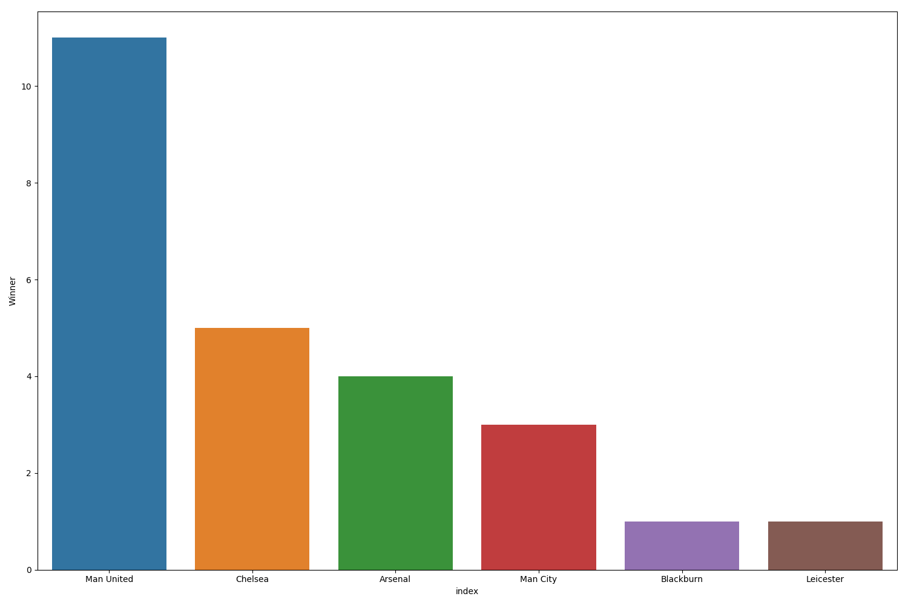

---

#### How many times does each team win?

+ I wonder how many times each team wins and how many times does a commom team win in one season. Obviously, it's related to the former one but may be more interesting.

```
a=epl_data.loc[:,['Season','Winner']]
b=a.groupby(['Season', 'Winner']).size().reset_index(name='Times')
c=b.sort_values(['Season', 'Times'], ascending=[True, False])
d=c[c.Winner.str.contains('Draw')==False].reset_index()
print(d)
plt.figure(figsize=(17, 6))
sns.countplot(x='Times' ,data=d)
plt.xticks(rotation='vertical')
plt.show()
```


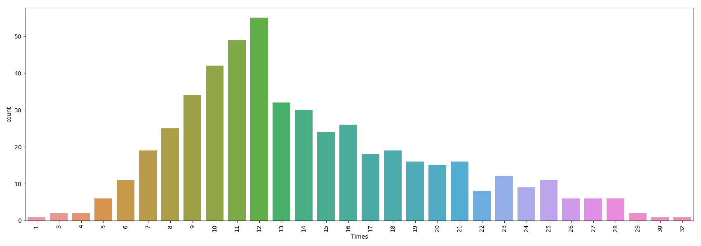


+ With the help of this picture, I can clearly figure out that only one team wins **32** times in one season and teams are most likely to win approximately **12** times in a season. 
+ It seems that there is a giant gap between **12** and **13**. As a soccor fan, I can immediately realize that this is because of the tremendous gap between *The Big Four* as well as other two 'Upstart' and other teams. These six teams are far richer than others and obviously have better performance with the help of the splendid players and coaches.


---

#### How do teams perform as hometeams?

+ It's widely acknowledged that the performance as hometeams and as awayteams can differ greatly. Playing as hometeams will be easier because of the cheering of tens of thousands of soccor fans, otherwise playing as awayteams always means unbelievably loud rude noises from tens of thousands of protestors. Apart from that, the arrangement of the playing stratagies, the familiarity of the field and the influence of judges are all inevitable when considering the differences between hometeams and awayteams. 

+ As for the great teams like *'The Big Four'* , the performance as hometeams can be dominating. It's common to see some of them may win almost all their home round. Furthermore, the smaller team will also pay attention on their home rounds because it can be much harder for them to win even one point as the awayteam. 

```
print(epl_data["HomeTeam"].value_counts(dropna=False))
```


+ Firstly, it's the times that all the teams play as hometeams. The more the times, the longer thay stay in *Premier League*. Apparently, *Man United*, *Chelsea*, *Arsenal*,*Liverpool* which are named *The Big Four* are always staying in *Premier League*.

```
plt.figure(figsize=(51, 18))
sns.countplot(x='HomeTeam',hue='HomeScore', data=epl_data)
plt.xticks(rotation='vertical')
plt.show()
```

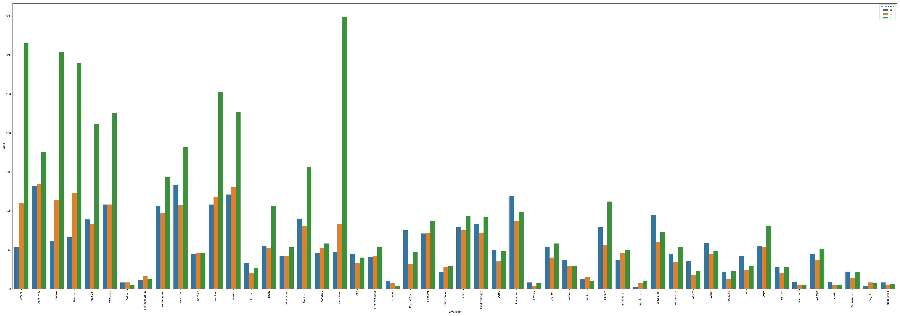

+ In the picture, the green column means winning, the yellow column means drawing and the blue column means failure. Obviously, *The Big Four*, especially *Man United* have dominating performance. 


---

#### How do teams perform as awayteams?

+ Taking what I have mentioned above into consideration, I can safely draw a conclusion that awayteams will have worse performance than hometeams do. It will be rare to see the dominating performance.

```
plt.figure(figsize=(51, 18))
sns.countplot(x='AwayTeam',hue='AwayScore',palette="Set2", data=epl_data)
plt.xticks(rotation='vertical')
plt.show()
```

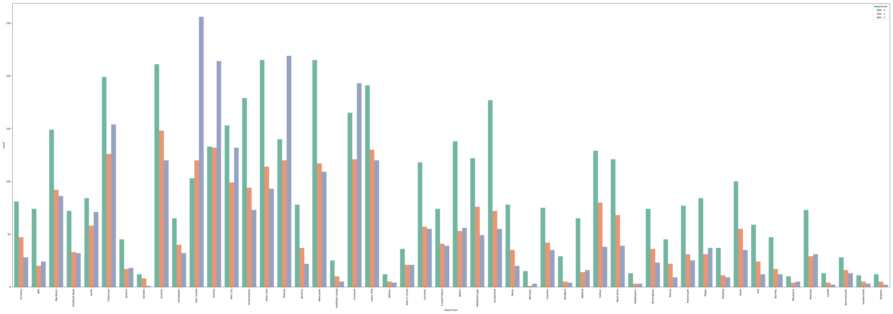

---

#### How many have teams goaled in the past 25 years?

* After analysing the winning or losing, let's focus on the most impressive part of such sports--**GOAL**. I wonder how many home goals and away goals each team have since the creation of *Premier League* in 1993.

```
plt.rcParams['figure.figsize'] = [18, 15]
temp=epl_data[['HomeTeam','FTHG']].groupby('HomeTeam').sum().sort_values(by='FTHG',ascending= True)
temp.plot.barh(color='purple')
plt.title('')
plt.show()
```

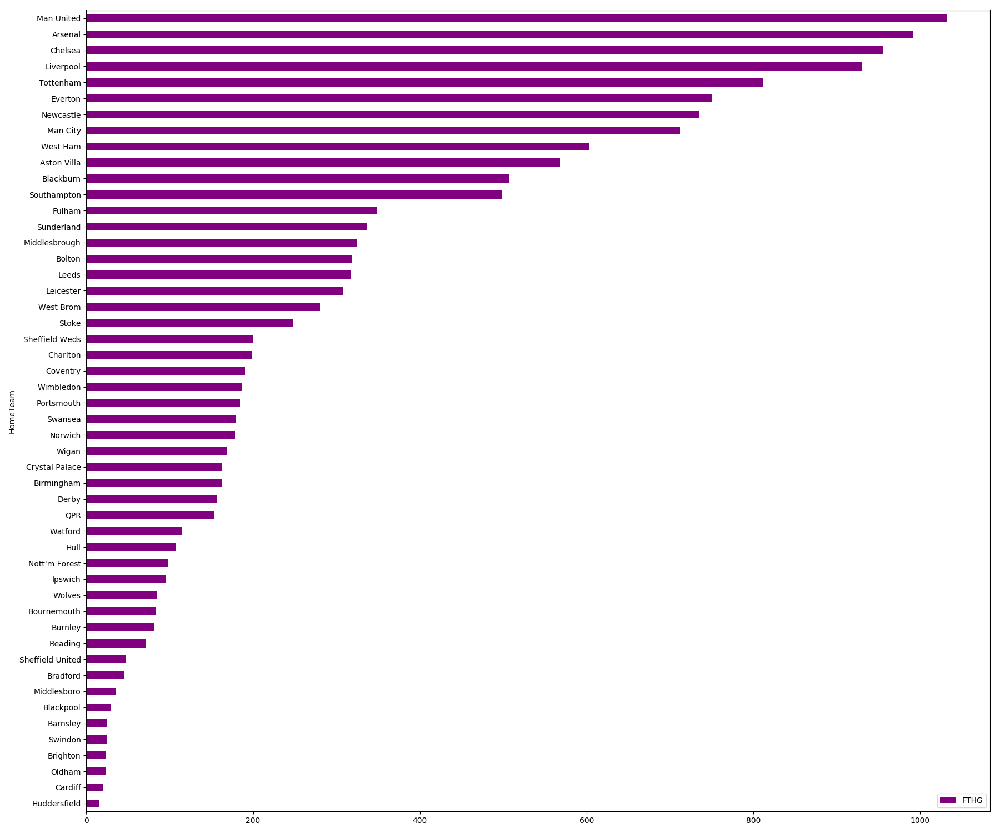

```
plt.rcParams['figure.figsize'] = [18, 15]
temp=epl_data[['AwayTeam','FTAG']].groupby('AwayTeam').sum().sort_values(by='FTAG',ascending= True)
temp.plot.barh(color='blue')
plt.title('')
plt.show()
```

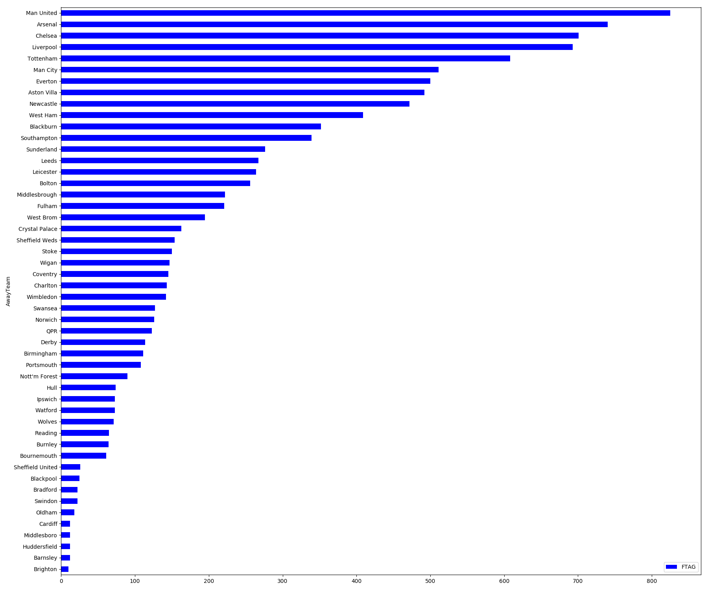

+ Evidently, *'The Big Four'* again takes the leading position and *Man United* shows us why it is named *'Red Devil'*. The attack of Man United is marvelous both as the hometeam and the awayteam.

<center></center>

---

#### How does Man United score each season as the hometeam?

+ It has been reported by *ESPN* that in Asia most soccor fans are also supporters of Man United. With the help of some related researches, we can find out that this is because in the 1990s a great number of Asian are exposed to some European soccor leagues and at that time, Man United was regarded as the best for a long period of time. Apparently, the dominating performance of Man United is appealing to the new fans and they have deliberately become supporters of Man United from then on.

+ As for me, I must admit that Man United is one of the most inspiring teams for me. Therefore, I am going to analyse the performance of Man United. Firstly, I will check how many goals Man United has each year.

```
utd = epl_data.groupby(['Season','HomeTeam']).FTHG.sum().reset_index()
utd = utd.loc[utd['HomeTeam'] == 'Man United']
plt.rcParams['figure.figsize'] = [20, 18]
sns.barplot(x='Season', y='FTHG', data=utd)
plt.show()
```

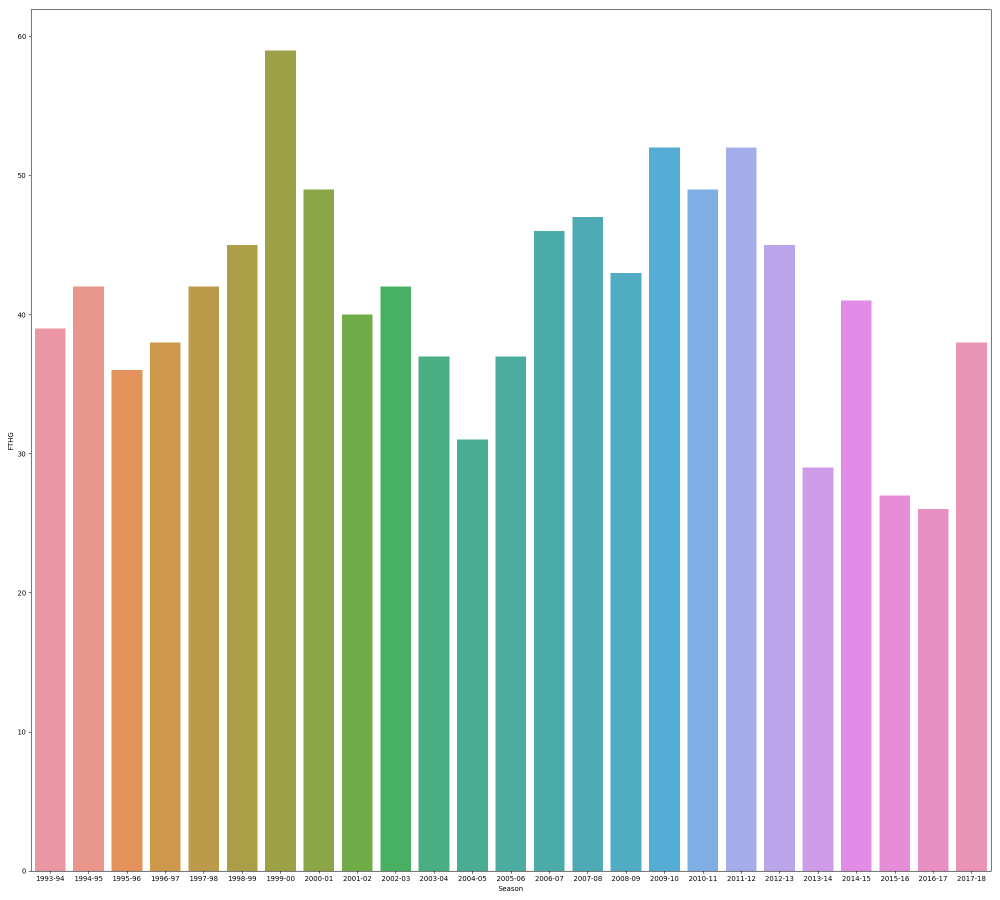

+ The picture is nice and thought-provoking because we can see some ups and downs and each of them is related to some long stories.

+ 1999-2000 Season is a marvelous season in the picture but unfortunately their performance was not that satifying. However, 1998-1999, the last season was legendary because they won all the champions around Europe and was honored as '*The Treble*'. Especially, **1999 UEFA Champions League Final** couldn't be more dramatic and was always viewed as the most impressive game in Man United's history.


+ 2013-2014 Season is obviously a sad season. **Sir Ferguson** has just retired after his 27 years' manager work in Man United at the end of the last season. David Moyes took his place but unluckily that was the beginning of a sad story and from then on Man United got into trouble. 
+ 2014-2015 Season is another story. Van Gaal became the manager but still didn't get back to the dominating conditions. Two years later, one of the world's most famous coaches, *Mourinho*, came to Man United and worked as manager until now.


---

#### How does Man United score each season as the hometeam?

+ Then let's look through their performance as the awayteam. 

```
utd = epl_data.groupby(['Season','AwayTeam']).FTAG.sum().reset_index()
utd = utd.loc[utd['AwayTeam'] == 'Man United']
plt.rcParams['figure.figsize'] = [20, 18]
sns.barplot(x='Season', y='FTAG', data=utd)
plt.show()
```

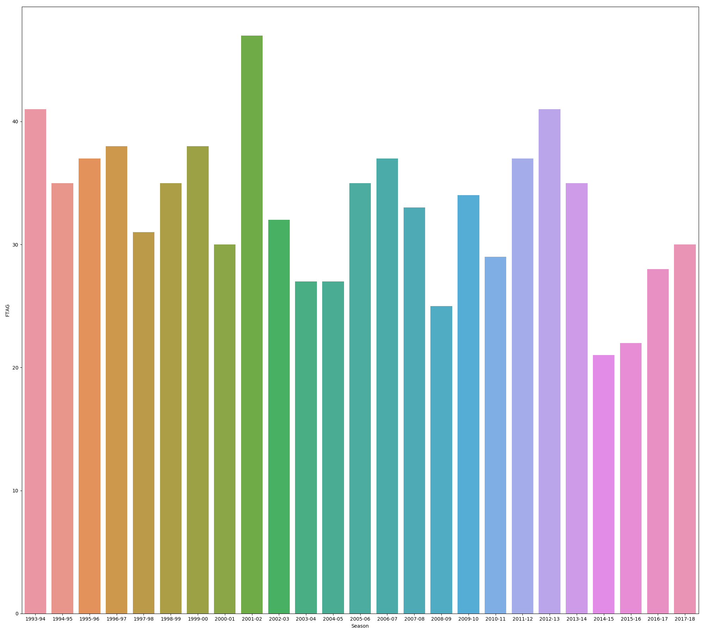

---

#### How many times does Man United win each season?

+ Based on the preprocess I have done, calculating how many times Man United wins each season is easy to compile. 

```
man = epl_data.loc[epl_data['Winner'] == 'Man United']
count_series = man.groupby(['Season']).size()
mancount = pd.DataFrame(data=count_series, columns=['Wins']).reset_index()
print(mancount)
plt.figure(figsize=(20, 20))
plt.plot('Season', 'Wins', data=mancount, marker='o',linewidth=3, color='red')
plt.show()
```

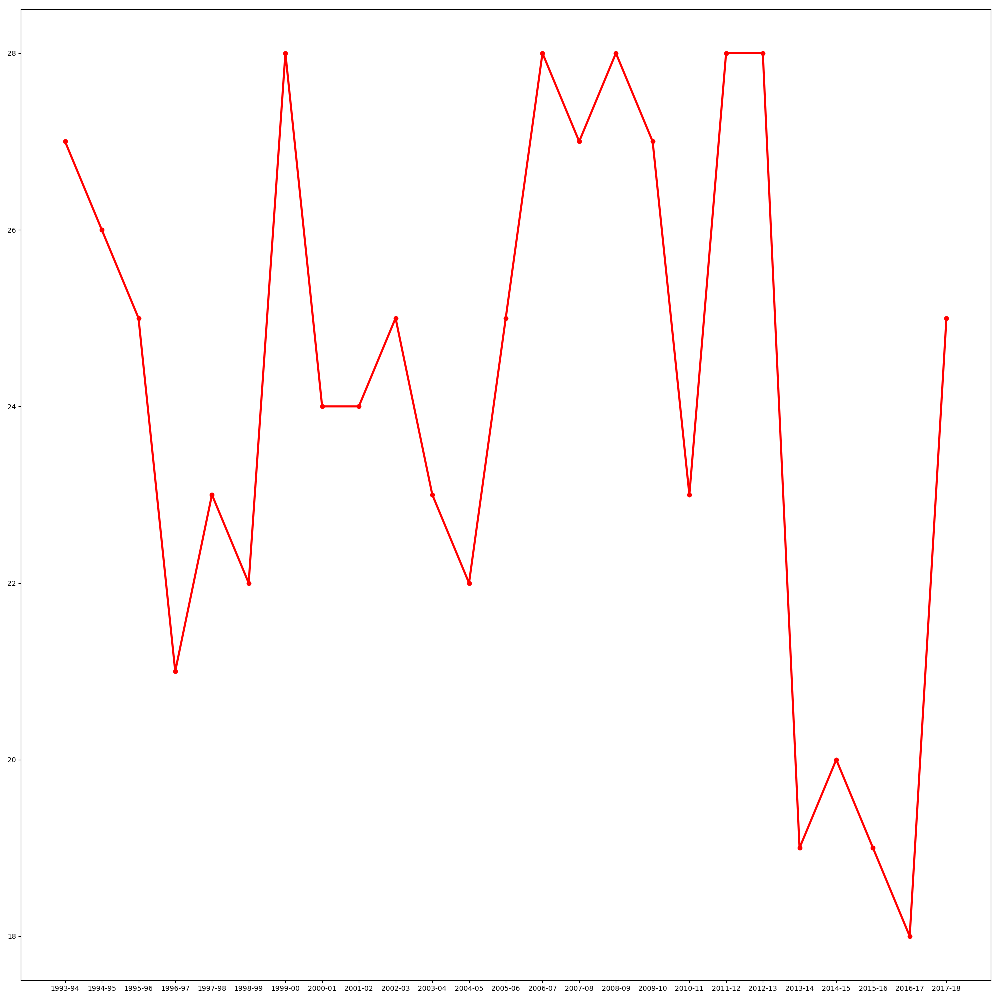

+ In the picture, clearly there are some variations corresponding with the changes I have mentioned. Fortunately we witnessed a come-back last year.

---

#### How is the Correlation Coefficient between the winning ratio and other attributes when it comes to Man United?

>Football is round.  &nbsp;&nbsp;-- Joseph Herberger

+ Obviously, it's not that easy to predict the correlation when it comes to the winning ratio of a football team. I attempt to figure out some factors of them. 

+ (*P.S: As the Half-Time data is missing in the first two years, we only use the data from 1995-2018.*

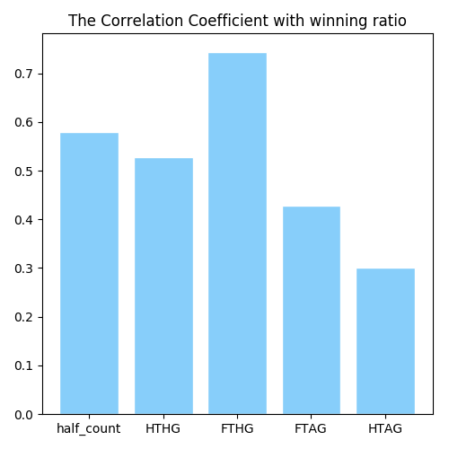

+ FTHG*(Full-Time HomeTeam Goal)* of Man United is the most relevant factor and it is easy to understand. The performance of half-game is also relevant. What impresses me most is that HTHG*(Half-Time HomeTeam Goal)* is also nice and significant. 

+ It opens up my mind that if the team can have suplendid performance as hometeams in the half-games, that means the team is having a high morale. They are willing to fight, to win and to persue the fame.

---

#### What if the cluster analysis?

+ Then I feel interested in the cluster analysis on the performance of Man United. I think their half-game performance is not that relevant to the winning ratio so I choose these. Moreover, K-Means algorithm is used because of the familiarity. 

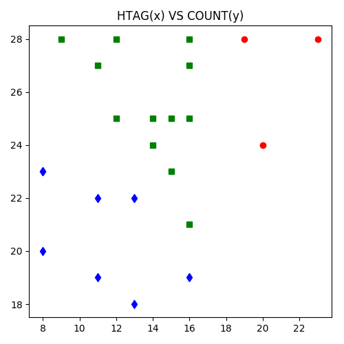 

---

#### How does Man United perform when faced with Arsenal?

+ Man United and Arsenal are always viewed as direct competitors because they have many things in common. Red is the symbol of both and their managers **Sir Ferguson** and **'*Professor*' Wenger** both enjoy high reputation in the past decades.


```
man_ars = epl_data[((epl_data['HomeTeam']=='Man United' )& (epl_data['AwayTeam']=='Arsenal'))|((epl_data['HomeTeam']=='Arsenal') & (epl_data['AwayTeam']=='Man United'))].groupby(['Winner'])['Winner'].count()
labels = (np.array(man_ars.index))
sizes = (np.array((man_ars / man_ars.sum())*100))
colors = ['gold', 'lightskyblue','lightgreen']
plt.subplots(figsize=(10, 8))
plt.pie(sizes, labels=labels, colors=colors, autopct='%1.1f%%', shadow=True, startangle=90)
plt.title("Win Ratio Between Man United and Arsenal")
plt.show()
```

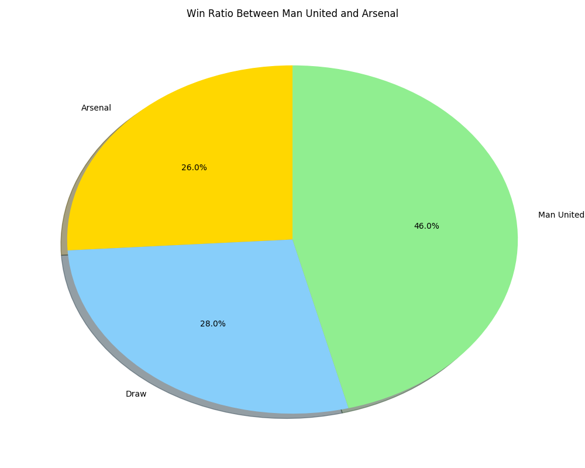

+ It seems that Sir Ferguson will smile more happily. 


---

#### How does Man United perform when faced with Man City?

+ **[Berby](https://baike.baidu.com/item/%E5%BE%B7%E6%AF%94/10557508?fr=aladdin)** is always viewed as the most exciting part of soccor. Mixed with history resentment and the willing to pursue glory, teams will spare no effort to fight against each other. 


+ Man City is also based in Manchester. With the unbelievable investment from Asia, it has made incredible progress in the past decade and took part in Premier League. 

```
man_derby = epl_data[((epl_data['HomeTeam']=='Man United' )& (epl_data['AwayTeam']=='Man City'))|((epl_data['HomeTeam']=='Man City') & (epl_data['AwayTeam']=='Man United'))].groupby(['Winner'])['Winner'].count()
labels = (np.array(man_derby.index))
sizes = (np.array((man_derby / man_derby.sum())*100))
colors = ['skyblue', 'lightgreen', 'gold']
plt.subplots(figsize=(10, 8))
plt.pie(sizes, labels=labels, colors=colors, autopct='%1.1f%%', shadow=True, startangle=90)
plt.title("Win Ratio Between Man United and Man City")
plt.show()
```

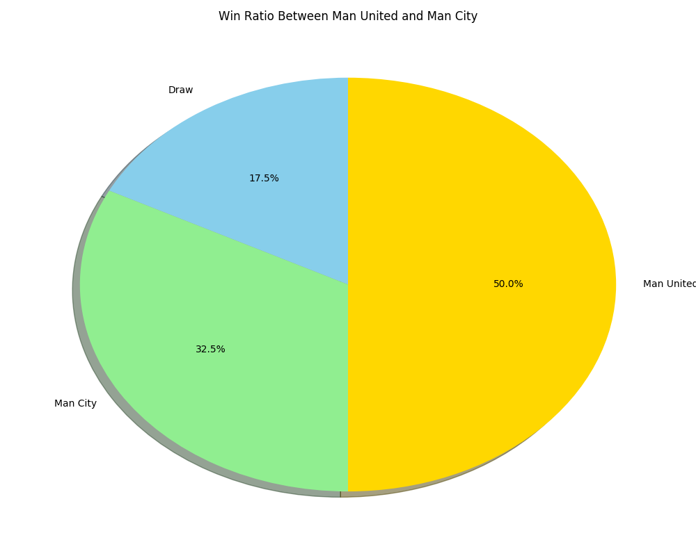

+ Evidently, Man United seems more powerful, whereas in the recent 5 years, Man City was generally more succseeful than Man United at home and abroad.

---

### Predict the performance of Man United in the future.

+ With the help of all the data in the past 25 years, I suppose I can make some simple prediction. Admittedly, soccor performance is hard to predict because of too much coincidence ,whereas I suppose predicting the performance of the whole season is feasible. 

+ I make sure to predict the times that Man United will win in the future two seasons based on the data in the past 25 years. Exponential smoothing, one of the most commonly used stratagies for short-term prediction, is used in my project.
+ Exponential smoothing is an easy-learned and easy-applied procedure for making some determination based on prior assumptions and is often used for analysis of time-series data. In my project, double exponential smoothing and triple exponential smoothing is used and both of the results will be shown in the same picture.
+ During this period, the value of smoothing parameter is really significant and I will have to make several attempt to find out the most seasible value.

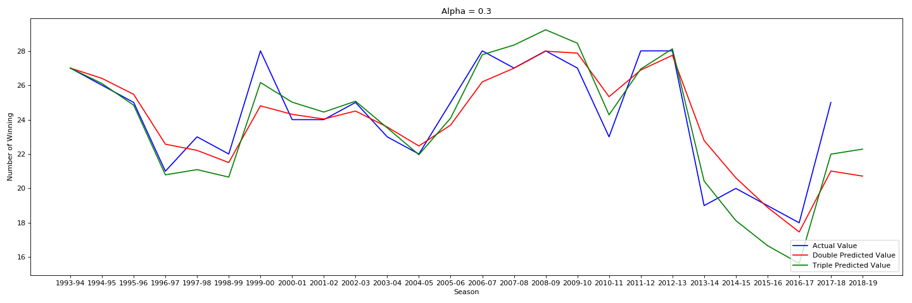

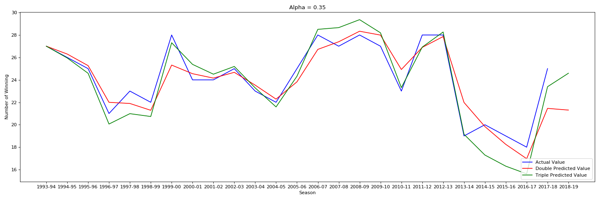

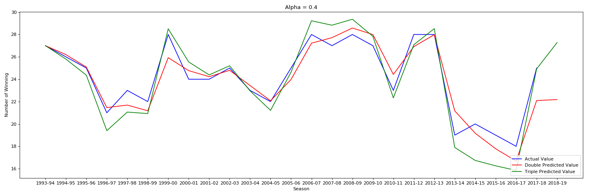

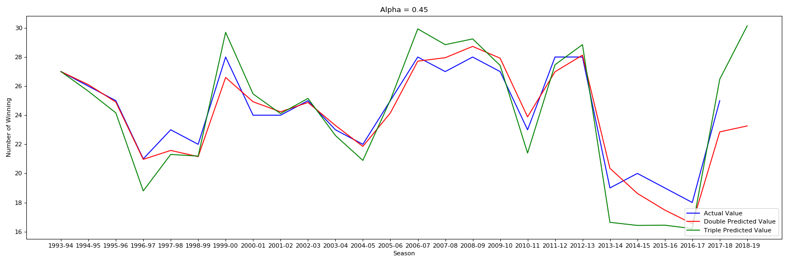

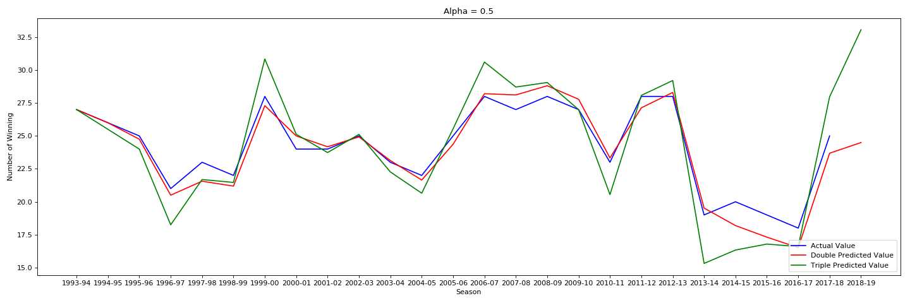


+ Judging from the result of 2017-18 Season, I can figure out that when the value of smoothing parameter is **0.4**, I can get the most convincing result and I suppose in 2018-2019 Season Man United may win about 27 rounds. It seems that *Mourinho* will have a bright future in Man United.


## One More Thing

+ In [118.31.47.171:8080](http://118.31.47.171:8080), we can see an amazing wordcloud in *Forum* part. I used to learn about `jieba` library to divide sentences into words when it comes to emotional analysis and I notice that it is related to the word cloud. Therefore, I attempted to make my own wordcloud approximately one month ago.  I suppose it really interesting so I make it one more thing for this report.

+ Luckily, I found `WordCloud` library, which makes it a piece of cake. Then at that time, I was learning about the report of 19th National Congress of the Communist Party of China in order to pass the exam to join the party, so I made up my mind to do something on my learning materials. 
+ Here is the picture. 


## Conclusion


+ Data mining and data analysis both play significant roles in computer science. I must say this course is a burst of light, bringing me into this colorful data analysis world. I always feel lucky to learn BI course in this way rather than just reciting something and finish the paper at the end of the term.

+ When it comes to the [AiStudio](http://aistudio.baidu.com/), it's widely acknowledged that such a platform will possess a bright future, whereas recently it still has a long way to go. As for *[PaddlePaddle](http://www.paddlepaddle.org/)*, there is no denying that *[TensorFlow](https://tensorflow.google.cn/)* will be a competitive counterpart and nowadays its first thing to do should be to enhance its reliability so that ordinary users like us will not feel mad dealing with those bugs. Admittedly, coding is not that relaxing especially when the tools we use are imprefect themselves.
+ As for me, I feel curious about this Chinese platform and framework initially. However, it failed to meet my expection only when my classmates and I were trying to install the framework. Later, I made up my mind to only use *PaddlePaddle* online to fulfill my practice, during which I felt excited to help fix the bugs I found, but I also realized that it would spend much time. Consequently, I would prefer *[Kaggle](https://www.kaggle.com)* and *tenforflow* to *AiStudio* and *PaddlePaddle* for further study if time is limited.


+ Let us return to this final report. Words fail to impress my enthusiasm and excitement when seeing the requirement. We are offered the freedom to cope with the problem we are interested in. That will make us spontaneously do some research and learn about the required skills. As for my project, I finish the requirement of *descriptive analysis*, enhancing my ability of data analysis and data visualization. I practice *Python* programming with the help of libraries I have mentioned. I suppose I have finished the most appealing final project that I have ever had. 
